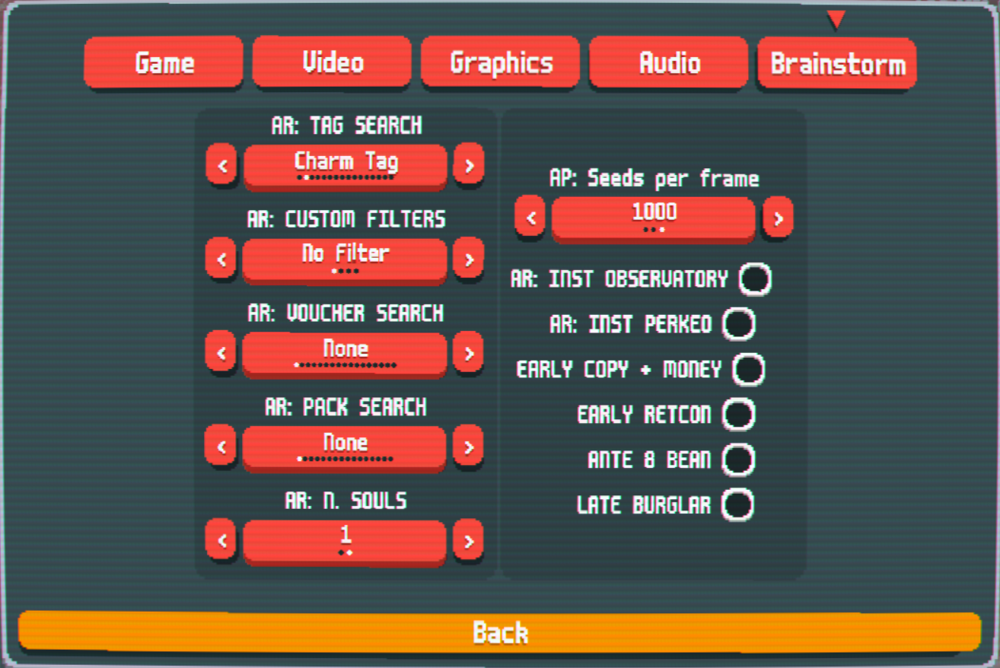

# Brainstorm Rerolled
This is a fork of both [Brainstorm](https://github.com/OceanRamen/Brainstorm) created by [OceanRamen](https://github.com/OceanRamen) as well as [Immolate](https://github.com/SpectralPack/Immolate) please give credit to them as I have simply modified the hard work they did

## Description
This repository houses both the code for the brainstorm mod as well as the code for the C++ version of the Immolate seed finder. If you would like to create your own filters simply 
add the code to the Immolate.cpp file, update the brainstorm endpoints to include whatever you need and then build it. This will generate a dll
that you can then place in the mods folder of balatro. The brainstorm mod will automatically detect the dll and use it, though you will need to update the brainstorm.lua and ui.lua 
in order to properly use your new options

## Requirements for Brainstorm
- [Lovely](https://github.com/ethangreen-dev/lovely-injector) injector -- Get it here: https://github.com/ethangreen-dev/lovely-injector/releases

## Installation

1. Install [Lovely](https://github.com/ethangreen-dev/lovely-injector) and follow the manual installation instructions.

### Windows

2. Download the [latest release](https://github.com/ABGamma/Brainstorm-Rerolled/releases) of Brainstorm-Rerolled.
3. Unzip the file, and place it in `.../%appdata%/balatro/mods` -- Make sure the Mod's directory name is 'Brainstorm' [^1]
4. Reload the game to activate the mod.

## Features
### Save-States
Brainstorm has the capability to save up to 5 save-states through the use of in-game key binds. 
> To create a save-state: Hold `z + 1-5`
> To load a save-state:	Hold `x + 1-5`

Each number from 0 - 5 corresponds to a save slot. To overwrite an old save, simply create a new save-state in it's slot. 

### Fast Rerolling
Brainstorm allows for super-fast rerolling through the use of an in-game key bind. 
> To fast-roll:	Press `Ctrl + r`

### Auto-Rerolling
Brainstorm can automatically reroll for parameters as specified by the user.
You can edit the Auto-Reroll parameters in the Brainstorm in-game settings page.
> To Auto-Reroll:	Press `Ctrl + a`

### Various Filters
In addition to the original filters from brainstorm I have added a few more filters that can help facilitate Crimson Bean or simply an easy early game  

ANTE 8 BEAN: This ensures you get a Turtle Bean within the first 150 items in the shop  
LATE BURGLAR: This ensures there is a burglar within the first 50-150 cards in the ante 6, 7, or 8 shop  
RETCON: This ensures that the retcon voucher appears before or in ante 8  
EARLY COPY + MONEY: This ensures that between the shop and the packs in ante 1 you get a brainstorm, blueprint, and some form of money generation

### Custom Filtering
I have added some basic code and an example to go off of to create custom filters. I have set it up so that custom filters will override any other selected filter to avoid crashes. If you want to use
the mod as originally created simply keep the custom filters set to "No Filter". If you want to create your own custom filters you will need to edit immolate.cpp and immolate.hpp to add your custom filter similar to how I added the "Negative Blueprint" filter
once added there you can build it and then copy the resulting dll into the brainstorm mod folder. Then you need to update the ui.lua and brainstorm.lua too add your new filter to the list.

#### Adding Custom Filters
1. Open immolate.hpp
	1. Add the name of your new filter to `enum class customFilters`
	1. Add a new case in `inline std::string filterToString(customFilters f)` for your new filter
	1. add a new if statement in `inline customFilters stringToFilter(std::string i)` for your new filter
1. Open immolate.cpp
	1. Add a new case in the switch statement for your filter to `long filter(Instance inst)`
	1. Add corresponding code inside of that case for your custom filter
1. Save and build the C++ code and copy the resulting dll into the brainstorm mod folder
1. Open ui.lua
	1. Add a new entry to the `local custom_filter_list` corresponding to your new filter
	1. Add a new entry to the `local custom_filter_keys` corresponding to your new filter
1. Save ui.lua and run the game
1. Your new filter should now be usable in the brainstorm settings

### Settings
Here is a bunch of settings in game
