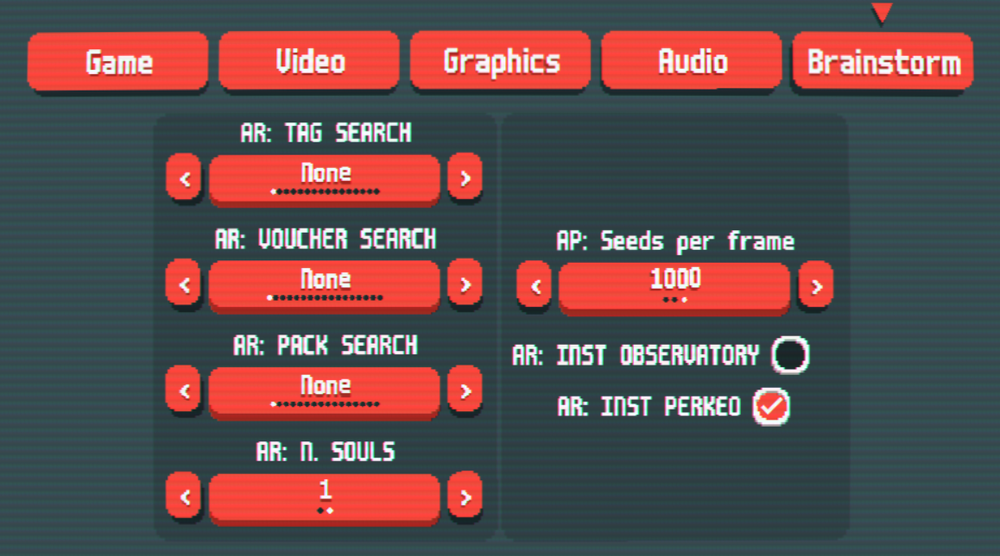

## Features
### Save-States
Brainstorm has the capability to save up to 5 save-states through the use of in-game key binds. 
> To create a save-state: Hold `z + 1-5`
> To load a save-state:	Hold `x + 1-5`

Each number from 0 - 5 corresponds to a save slot. To overwrite an old save, simply create a new save-state in it's slot. 

### Fast Rerolling
Brainstorm allows for super-fast rerolling through the use of an in-game key bind. 
> To fast-roll:	Press `Ctrl + t`

### Auto-Rerolling
Brainstorm can automatically reroll for parameters as specified by the user.
You can edit the Auto-Reroll parameters in the Brainstorm in-game settings page.
> To Auto-Reroll:	Press `Ctrl + a`

### Settings
Lot of settings to reroll seeds
